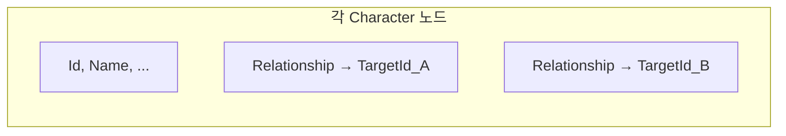
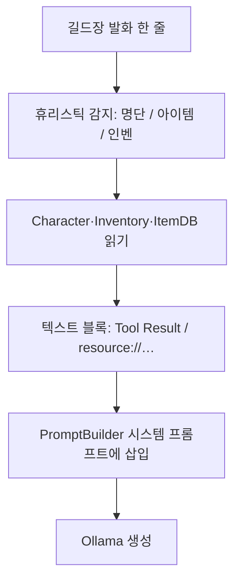

# 13. 구현 상세 — 관계 데이터 · 소셜 정산 · “MCP” 런타임

이 문서는 **코드에 실제로 있는 것**을 기준으로 한다.  
“관계를 그래프로 만들었다”는 표현에 가깝게 구현된 부분과, **그렇지 않은 부분**(별도 그래프 DB·시각화·외부 MCP 서버)을 구분한다.

---

## 13.1 관계 데이터: 이론상의 그래프 vs 코드 구조

### 수학적으로

길드원 간 관계를 **방향 그래프**로 보면, 꼭짓점은 캐릭터 `Id`, 간선은 `(fromId → targetId)`에 가중치 `Affinity`, `Trust`, 라벨 `RelationType`을 둔 **가중 방향 그래프**로 모델링할 수 있다.

### 실제 구현 (`Character.cs`)

- 각 캐릭터는 **`Relationships: List<Relationship>`** 만 가진다.
- `Relationship`은 **`TargetId` 한 방향**만 저장한다 (`Character.cs`).

```112:118:MiniProjects/GuildDialogue/Data/Character.cs
public class Relationship
{
    public string TargetId { get; set; } = string.Empty;
    public int Affinity { get; set; } // 친밀도 (0~100)
    public int Trust { get; set; }    // 신뢰도 (0~100)
    public string RelationType { get; set; } = string.Empty; // 관계 유형 (예: 소꿉친구, 비즈니스)
}
```

- **인접 리스트(출발지 기준)** 형태에 가깝다.  
- **역방향 간선**(B가 A를 어떻게 보는지)이 필요하면 **B의 `Relationships`에 `TargetId == A`** 항목이 **별도로** 있어야 한다. 코드가 자동으로 대칭을 맞추지는 않는다.
- 별도 **그래프 전용 라이브러리**(NetworkX, Neo4j 클라이언트 등)는 **없다**. `grep` 기준 `Graph`/`adjacency` 클래스도 없다.

### 프롬프트에의 반영 (`PromptBuilder`)

- 화자·청자 한 쌍에 대해 **`speaker.Relationships`에서 `listener.Id`와 일치하는 한 줄**만 꺼내 텍스트로 넣는다 (`AppendSocialRelationshipContext`).

요약: **“관계 그래프를 별도 엔진으로 구축했다”기보다는**, JSON·DTO 상 **출발 노드당 나가는 간선 목록**으로 두고, 대화 시에는 **해당 에지만 읽는다**.

### (참고) 데이터 관점 다이어그램



---

## 13.2 런타임에 관계 수치가 바뀌는 경로

| 경로 | 구현 | 비고 |
|------|------|------|
| **대화 세션 종료 정산** | `DialogueManager.UpdateSocialSettlementAsync` | Ollama에 **대화 텍스트**를 주고, **`화자Id->대상Id` 키**의 JSON 객체로 `affinity`/`trust` **델타**를 요청. |
| **델타 적용** | `TryApplySocialSettlementDeltasFromJson` | 이미 존재하는 `Relationships` 엣지에만 가산. **엣지가 없으면 스킵**. 0~100 클램프. |
| **관전 모드 사회적 인상** | `SynthesizeSocialImpressionsAsync` | 에피소드 버퍼로 **별도 JSON** 딕셔너리 생성 — 키 형식은 `화자Id->청자Id` 스타일을 기대하지만, 이후 턴은 주로 `GetValueOrDefault($"{speaker.Id}->{listener.Id}")` 형태로 **인상 문자열**에 쓰인다(수치 그래프 갱신과는 별 트랙). |

정리: **엣지 가중치를 직접 고치는 것**은 “세션 종료 정산” 쪽이고, **임프레션 문자열**은 관전 흐름의 보조 신호다.

---

## 13.3 “MCP를 활용했다”에 대한 정확한 구현

### 외부 MCP 서버가 아니다

- `AethelgardMcpRuntimeFacts` 파일 주석에도 나와 있듯, **동일 프로세스 C#**에서 문자열 블록을 만든다.

```10:14:MiniProjects/GuildDialogue/Services/AethelgardMcpRuntimeFacts.cs
/// <summary>
/// [에델가드 MCP 런타임 팩트 엔진]
/// ...
/// 7B 모델의 토큰 다이어트와 팩트 정확도를 함께 맞추는 계층입니다(외부 MCP 서버가 아닌 본 앱 C# 실행).
/// </summary>
```

- `Retrieval.UseMcpRuntimeToolFacts == true`일 때만 `PromptBuilder` 쪽으로 블록이 전달된다.

### 역할

1. **사용자(길드장) 한 줄**을 보고, 휴리스틱으로 **어떤 “도구 결과”를 붙일지** 결정한다.
2. 출력 형식은 **`[Tool Result: Verify_Member]`**, **`[Tool Result: Resolve_Item_Ownership]`**, **`[Resource: inventory/all_snapshot]`** 등 **MCP/툴 결과를 흉내 낸 텍스트**다.
3. **URI 스타일 문자열**으로 팩트를 고정한다. 예:
   - `resource://guild/roster`
   - `resource://inventory/{characterId}`
4. **가짜 인물**(`GhostNameHints`: 브라이언, 카일리 등)이 질문에 들어오면 **명단·DB 대조** 결과를 한 줄로 적어 LLM이 환각을 줄이게 한다.

### 감지 요약 (코드 기준)

- **이름/명단 질문**: `누구`, `파티원`, `소속` 등 + 이름 부분 문자열, `…이/가` 앞 2~8글자 한글 추출(정규식 `s_subjectBeforeIga`).
- **소유/아이템**: 아이템 DB·인벤에 나온 이름이 질문에 포함되거나, `가지고`, `루팅` 등 소유 패턴.
- **전체 인벤**: `가방`, `인벤`, `소지품` 등 — 파티 전원 스냅샷.
- **아이템 정의(효과·설명)**: 질문에 `효과`, `설명`, `뭐야`, `도감` 등 **정의 의도**가 있고, 동시에 **ItemDatabase에 등록된 `ItemName`**이 문장에 포함되면 `[Tool Result: Lookup_Item_Definition]`에 `Effects`·`Description` 등 **JSON 확정값**을 싣는다(효과 환각 억제).
- **풀 이름이 없을 때(인벤 폴백)**: 문장에 DB 풀 네임이 없어도, **화자(응답 NPC) 인벤**에 있고 DB에 정의된 아이템으로 좁힌다. (1) 인벤·DB 교집합이 **1종**이면 자동 매칭. (2) **대명사·맥락**(`그`, `그거`, `방금`, `아까` 등)이 있으면 후보 **최대 8종**. (3) 질문에 **「포션」**만 있으면 이름에 `포션` 포함 항목만. 그 외 여러 종이면 블록 생략(애매함).

### 변칙 입력과의 연동

- `GuildMasterAtypicalInputKind.Gibberish`이면 **MCP 블록 생성 안 함**(`Build` 초반 return).

### 아키텍처 스케치



**향후**: 진짜 MCP(Model Context Protocol) 서버를 붙이려면, 지금 블록 생성부를 **RPC 대체**하고 동일 스키마의 문자열만 주입하도록 바꾸는 식이 자연스럽다.

---

## 13.4 RAG·임베딩 쪽은 “그래프”가 아니다

- `EmbeddingKnowledgeIndex`는 **청크 벡터 + 코사인 유사도**다. 지식 그래프 DB가 아니다.
- [04](04-LLM-연동-설계.md), [08](08-런타임-시퀀스-상세.md)와 함께 본다.

---

## 13.5 파티 “관계”와의 혼동 방지

- `PartyRosterResolver`는 **`PartyId`로 같은 파티원만 필터**하는 **집합·멤버십** 로직이다. 소셜 그래프와는 데이터가 다르다(`PartyDatabase.json` + `Character.PartyId`).

---

## 13.6 관련 문서

| 문서 | 내용 |
|------|------|
| [08-런타임-시퀀스-상세](08-런타임-시퀀스-상세.md) | 길드장 턴에서 RAG·MCP 블록이 언제 켜지는지 |
| [09-설정-키-완전-참조](09-설정-키-완전-참조.md) | `UseMcpRuntimeToolFacts` |
| [04-LLM-연동-설계](04-LLM-연동-설계.md) | 3층 프롬프트 개요 |

다음: [07-문서-맵과-코드-읽기-가이드.md](07-문서-맵과-코드-읽기-가이드.md)에서 전체 맵을 갱신한다.
